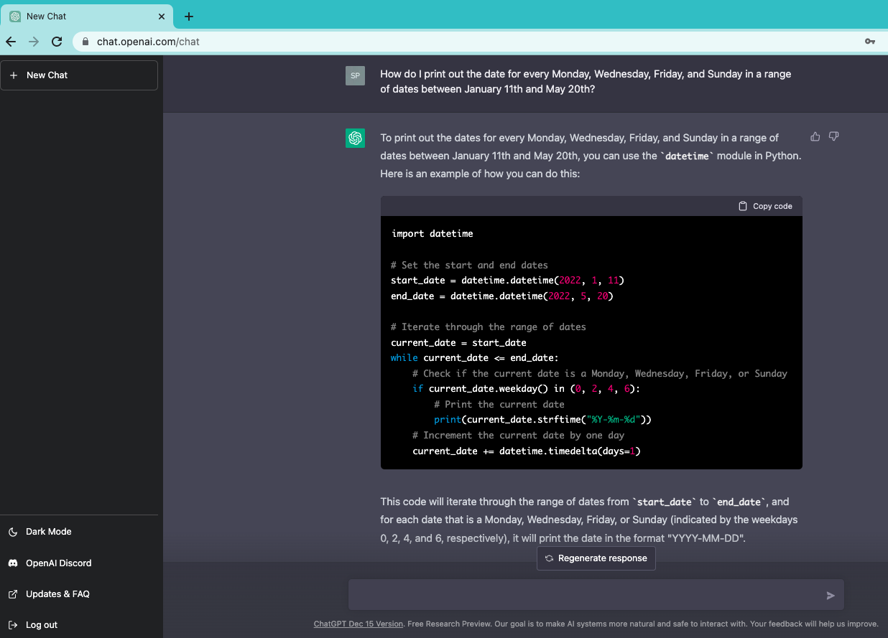
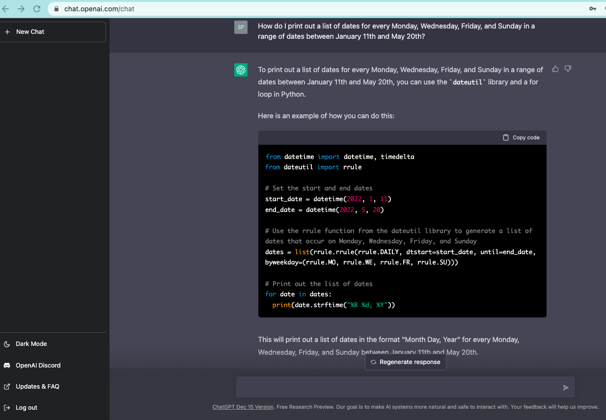

So, like so many ([here](https://medium.com/geekculture/hey-chatgpt-solve-these-coding-tasks-using-python-b2e7482f2c18) and [here](https://levelup.gitconnected.com/building-a-python-interpreter-inside-chatgpt-49251af35fea) as nice and simple examples—heck, even Graham Harman has gotten into the discussion [here](https://doctorzamalek2.wordpress.com/2022/12/17/chatgpt-imitating-me/)) in the computer science field, I have been playing around with the newly-released "ChatGPT" chatbot released through [openAI](https://chat.openai.com/auth/login). It's also that time of the year when we academics start turning to getting all of those syllabi for the upcoming Spring semester ready to go. We all now how onerous it can be to create, say, a reading schedule with dates that we always need to shift when we move from one semester to another. (In the past, before learning how to solve/code this myself, I would run to that nice ["Syllabus Maker"](http://wcaleb.rice.edu/syllabusmaker/generic/) tool courtsey of Caleb McDaniel and rely on it). I figured I would throw it a simple task to see what it came up. The question I posed was simple enough (and is simple enough for us lowly mortals who know how to code things like this ourselves, to be sure): "How do I print out the date for every Monday, Wednesday, Friday, and Sunday in a range of dates between January 11th and May 20th?"

The bot spit out the following code snippet utilizing Python's standard [datetime library](https://docs.python.org/3/library/datetime.html), using a simple ```while``` loop:



What I also really liked about this was that if you switch up the language of the initial query, you get a slightly different answer. In the question about I didn't ask it to put the dates in a list, but simply to "print out those dates." If you change it up slightly—"How do I print out a list of dates for every Monday, Wednesday, Friday, and Sunday in a range of dates between January 11th and May 20th?"—you get the following:



How cool is it that the thing produces code commentary as well? Really sick—that's for darn sure! Admittedly, pitching it a coding problem might not seem like all that hard of a pitch to hit out the park. Even still. I'm greatly looking forward to continuing to play around with this thing.